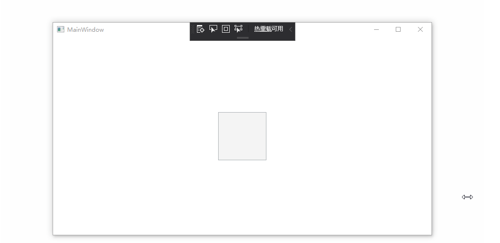

# ExtendedResizeBorder
这是一个让WPF可以在窗口之外区域获得拖动缩放能力的控件。

## 极其简单的接入

只需要在指定窗口的xaml添加如下的依赖属性即可

并且通过Radius设置border的Thickness

```xml
<Window x:Class="WpfApp2.MainWindow"
        xmlns="http://schemas.microsoft.com/winfx/2006/xaml/presentation"
        xmlns:x="http://schemas.microsoft.com/winfx/2006/xaml"
        xmlns:d="http://schemas.microsoft.com/expression/blend/2008"
        xmlns:mc="http://schemas.openxmlformats.org/markup-compatibility/2006"
        xmlns:extendedResizeBorder="clr-namespace:ExtendedResizeBorder;assembly=ExtendedResizeBorder"
        mc:Ignorable="d"
        Title="MainWindow" Height="450" Width="800">
    <extendedResizeBorder:ExtendedResizeBorder.ExtendedResizeBorder>
        <extendedResizeBorder:ExtendedResizeBorder Radius="100" />
    </extendedResizeBorder:ExtendedResizeBorder.ExtendedResizeBorder>
    <Grid Background="Transparent" MouseDown="UIElement_OnMouseDown">
        <Grid Margin="100" Background="White" />
        <Button Width="100" Height="100" Command="Undo" />
    </Grid>
</Window>
```

## 效果



## blog

- [如何使WPF在窗口外部区域可拖动缩放 - csdn](https://blog.csdn.net/htxhtx123/article/details/106289839)
- [如何使WPF在窗口外部区域可拖动缩放 - github.io](https://xinyuehtx.github.io/post/%E5%A6%82%E4%BD%95%E4%BD%BFWPF%E5%9C%A8%E7%AA%97%E5%8F%A3%E5%A4%96%E9%83%A8%E5%8C%BA%E5%9F%9F%E5%8F%AF%E6%8B%96%E5%8A%A8.html)
- [WPF 制作高性能的透明背景异形窗口（使用 WindowChrome 而不要使用 AllowsTransparency=True） - walterlv](https://blog.walterlv.com/post/wpf-transparent-window-without-allows-transparency.html)